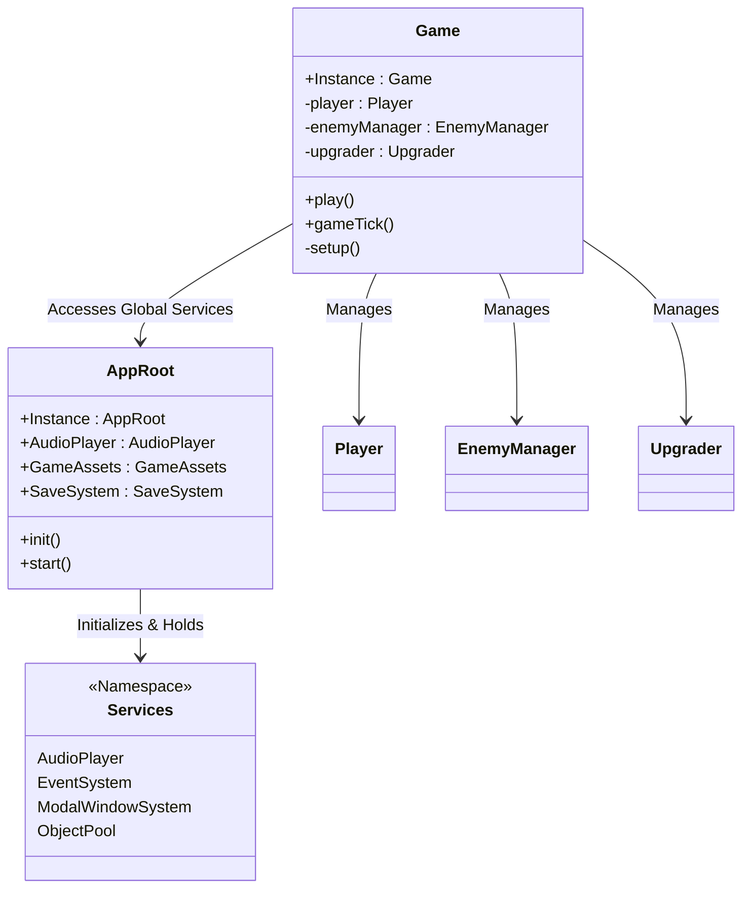
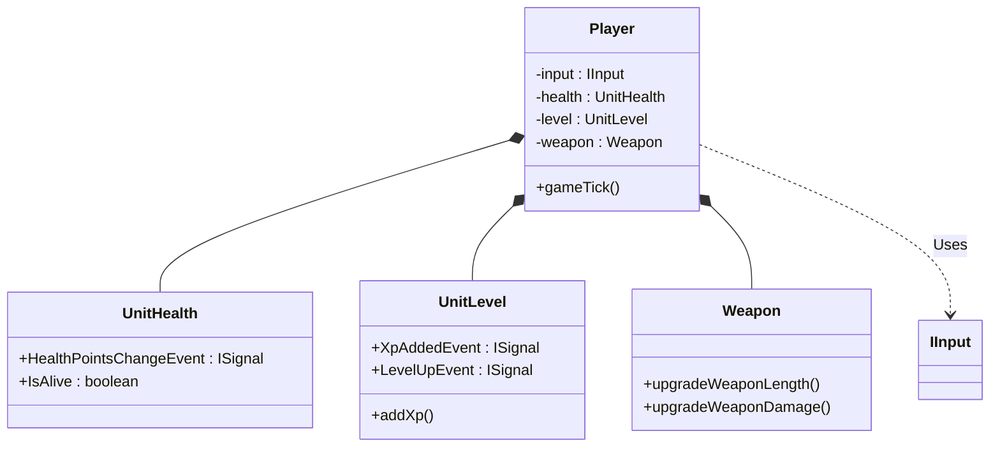
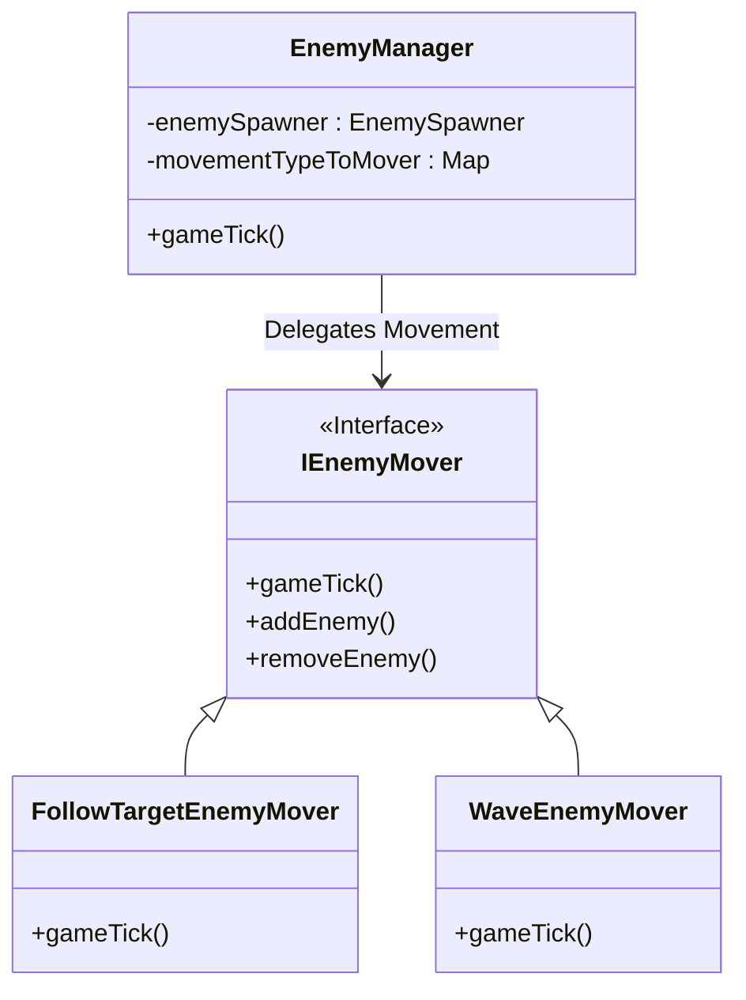

# Cocos Creator 游戏设计分析文档: Slash-The-Hordes

## 1. 项目概览

*   **项目名称**: Slash-The-Hordes
*   **引擎版本**: Cocos Creator 3.8.6
*   **游戏类型**: Roguelike Survivor (类吸血鬼幸存者)
*   **核心玩法**: 玩家控制角色在无尽的敌人潮中生存，通过击杀敌人获取经验升级，选择随机的技能升级来增强自身战斗力。

## 2. 整体架构设计

游戏采用典型的 **组件化 (Component-Based)** 与 **服务导向 (Service-Oriented)** 相结合的架构。

*   **AppRoot (全局入口)**: 作为常驻节点 (PersistRootNode)，管理游戏的生命周期、全局服务 (音频、存档、统计) 和场景切换。
*   **Game (游戏核心)**: 负责单次游戏局内的逻辑循环、依赖注入、系统初始化和帧更新。
*   **Services (通用服务)**: 提供独立于具体游戏逻辑的功能，如对象池、事件系统、UI 弹窗管理。

### 核心架构图

## 3. 详细子系统设计

### 3.1 应用程序生命周期 (AppRoot)

`AppRoot` 是游戏的根管理器，它是一个单例组件。

*   **职责**:
    1.  **初始化**: 加载存档 (`SaveSystem`)、配置 (`GameSettings`)、音频 (`AudioPlayer`)。
    2.  **持久化**: 使用 `director.addPersistRootNode` 确保跨场景存在。
    3.  **数据中心**: 提供 `LiveUserData` (玩家存档) 和 `Settings` 的全局访问点。

### 3.2 游戏主循环 (Game)

`Game` 组件是游戏场景的控制器。

*   **职责**:
    *   **依赖注入 (DI)**: 在 `setup()` 方法中手动组装各个子系统 (如将 `Player` 注入 `EnemyManager`，将 `Upgrader` 注入 `GameUI`)。
    *   **手动 Update**: 使用 `gameTick(deltaTime)` 统一管理所有子系统的更新顺序，而非依赖 Cocos 默认的 `update` 分散调用，这有助于精确控制执行顺序 (例如：先移动，再碰撞检测)。
    *   **流程控制**: `play()` 方法是一个异步函数，通过 `while` 循环维持游戏进行，直到玩家死亡或退出。

### 3.3 玩家系统 (Player System)

玩家实体被拆分为多个专职组件，由 `Player` 类统一协调。

*   **输入抽象 (`IInput`)**: 支持键盘 (WASD/箭头) 和虚拟摇杆 (`VirtualJoystick`)，通过 `MultiInput` 聚合多种输入方式。
*   **组件构成**:
    *   `UnitHealth`: 处理生命值和死亡逻辑。
    *   `UnitLevel`: 处理经验值获取和等级提升。
    *   `Weapon`: 处理近战攻击逻辑。
    *   `Magnet`: 处理物品吸附范围。
    *   `PlayerRegeneration`: 处理生命自动回复。

### 3.4 敌人系统 (Enemy System)

敌人系统设计了灵活的生成和移动策略。

*   **EnemyManager**: 核心管理器，维护 `EnemySpawner` 和移动器映射。
*   **生成策略 (Spawning)**:
    *   `IndividualEnemySpawner`: 单个生成。
    *   `CircularEnemySpawner`: 环形包围生成。
    *   `WaveEnemySpawner`: 针对特定波次的生成。
*   **移动策略 (Movement)**: 使用策略模式 (`Strategy Pattern`)，通过 `IEnemyMover` 接口实现。
    *   `FollowTargetEnemyMover`: 持续追踪玩家。
    *   `WaveEnemyMover`: 直线冲锋/发射型移动。
    *   `PeriodicFollowMovers`: 周期性追踪。

### 3.5 战斗与投射物 (Combat & Projectiles)

战斗系统基于碰撞检测和投射物发射器。

*   **发射器 (ProjectileLauncher)**:
    *   `HaloProjectileLauncher`: 环绕角色的光环攻击。
    *   `WaveProjectileLauncher`: 波浪/直线形弹幕 (水平、对角线)。
    *   `EnemyProjectileLauncher`: 敌人使用的远程攻击 (斧头、法球)。
*   **碰撞系统**:
    *   独立于物理引擎的简单距离/AABB检测 (推测)，或对 Cocos 碰撞回调的封装。
    *   `PlayerCollisionSystem`: 处理玩家与敌人的碰撞。
    *   `WeaponCollisionSystem`: 处理近战武器与敌人的碰撞。
    *   `PlayerProjectileCollisionSystem`: 处理玩家子弹与敌人的碰撞。

### 3.6 升级系统 (Upgrade System)

Roguelike 的核心——局内成长。

*   **Upgrader**: 管理升级逻辑。它将 `UpgradeType` 枚举映射到具体的执行函数。
*   **UpgradeType**: 定义了如 `WeaponLength` (武器长度), `WeaponDamage` (伤害), `HaloProjectlie` (光环) 等升级类型。
*   **流程**:
    1.  玩家升级触发事件。
    2.  `GameModalLauncher` 暂停游戏并显示升级弹窗。
    3.  玩家选择升级项。
    4.  `Upgrader` 执行对应逻辑 (如增加 `typeToLevel` 计数，调用 `player.Weapon.upgrade...`)。

### 3.7 UI 系统 (UI System)

*   **GameUI**: 负责 HUD 显示 (血条、经验条、存活时间、金币)。通过观察者模式 (`ISignal`) 监听数据变化并更新 UI。
*   **ModalWindowSystem**: 通用的弹窗管理器，处理暂停、升级选择、游戏结束等界面。

## 4. 数据与持久化

*   **GameSettings**: JSON 配置文件，定义了玩家初始属性、敌人波次数据、升级参数等。这使得策划调整数值无需修改代码。
*   **UserData**: 玩家存档数据，包含元游戏升级 (Meta Upgrades) 状态、金币数量等。
*   **SaveSystem**: 负责 `UserData` 的序列化与反序列化 (本地存储)。

## 5. 总结

Slash-The-Hordes 展示了一个结构清晰、扩展性强的游戏架构。其主要优点包括：
*   **清晰的职责分离**: 全局管理与局内逻辑分离，UI 与逻辑分离。
*   **灵活的策略模式**: 敌人的移动和生成逻辑高度模块化，易于新增敌人类型。
*   **数据驱动**: 核心数值依赖 JSON 配置，利于平衡性调整。
*   **可控的更新循环**: 通过 `gameTick` 手动管理更新顺序，避免了 Unity/Cocos 中常见的执行顺序不确定性问题。
